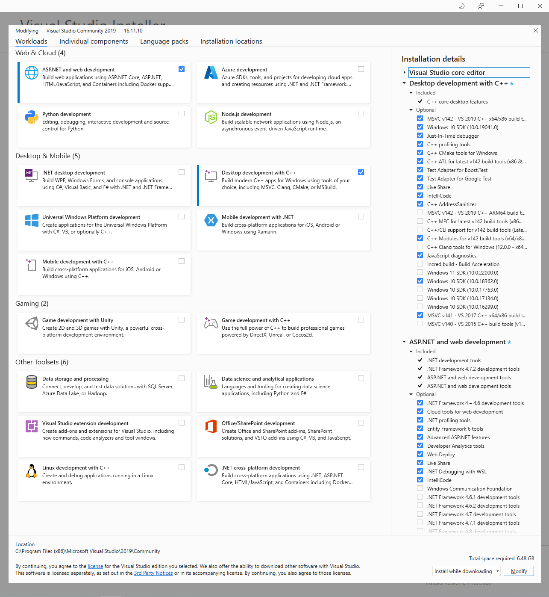
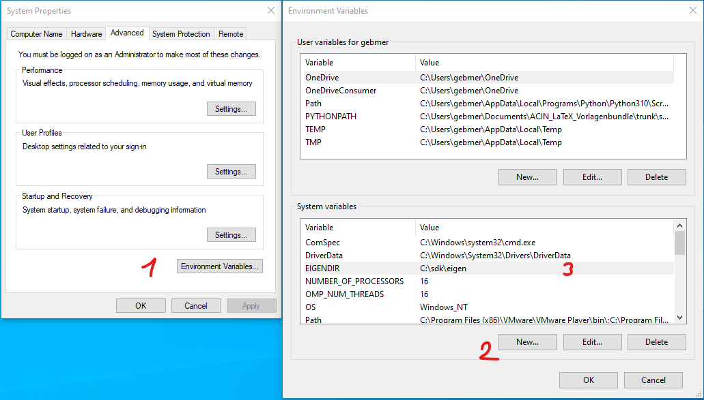
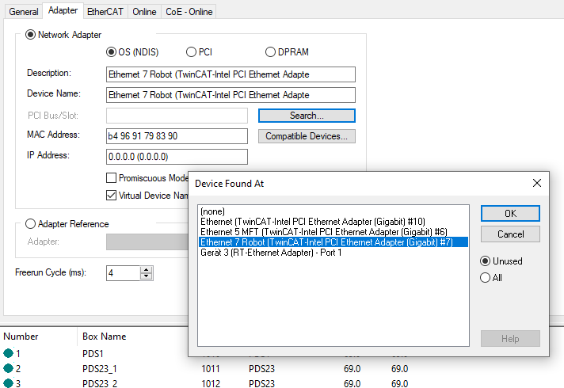

# IiwaControl — ORC Controller + Robot Simulation on TwinCAT (hard real-time)

This TwinCAT C++ project runs the **ORC controller and a MuJoCo robot
simulation of a KUKA LBR iiwa together in hard real-time** on a TwinCAT
target. It is the *server* side of the ORC client–server architecture:

```
┌──────────────────────────┐         UDP          ┌────────────────────────────────────────────┐
│  Client (devcontainer)   │  trajectory  ─────▶  │  TwinCAT target (hard real-time, 8 kHz)      │
│  orcpy / Python          │   :10000             │                                              │
│  client_with_            │                      │   UdpInterface  ──▶  OrcController (ORC)      │
│  visualization.py        │  RobotState  ◀─────  │        ▲                    │ torque         │
│  (digital-twin viewer)   │   :11000             │        └── RobotSimulation ◀┘ (MuJoCo MJB)   │
└──────────────────────────┘                      └────────────────────────────────────────────┘
```

The whole control loop — trajectory interpolation, the model-based ORC
controller, and the MuJoCo physics simulation — executes deterministically at
**8 kHz (125 µs task cycle)** inside the TwinCAT real-time kernel. The Python
client only plans/streams trajectories and mirrors the returned `RobotState`
as a passive digital twin. Because of ORC's deployment parity, moving from this
simulation to a physical iiwa is a matter of swapping the `RobotSimulation`
module for EtherCAT motor drivers (see [Migrating to a real robot](#migrating-to-a-real-robot)).

The three active real-time modules are:

| Module | Project folder | Role |
| --- | --- | --- |
| `UdpInterface` | [`IiwaControl/UdpInterface/`](IiwaControl/UdpInterface/) | UDP endpoint: receives trajectories, sends `RobotState`, bridges the SIL ports. |
| `OrcController` | [`IiwaControl/OrcTcControl/`](IiwaControl/OrcTcControl/) | The ORC controller (computed-torque), produces joint torques. |
| `RobotSimulation` | [`IiwaControl/RoboSimFast/`](IiwaControl/RoboSimFast/) | MuJoCo simulation of the iiwa, integrates torques → joint state. |

---

## 1. Prerequisites

### TwinCAT with C++ support

1. **Install TwinCAT 3 with the C++ feature** (TC1300 "TwinCAT 3 C++").
   The C++ build requires a matching Visual Studio / build-tools toolset
   (VS 2019 / v141 is used by this project — install the *Desktop development
   with C++* workload). See Beckhoff InfoSys:
   - C++ overview: <https://infosys.beckhoff.com/content/1033/tc3_c/index.html>
   - Requirements / installation: <https://infosys.beckhoff.com/content/1033/tc3_c/3523158923.html>

   

2. **Determine your TwinCAT version** so it matches the project / certificate
   requirements (TwinCAT XAE shell → *Help → About*, or the version shown in
   the system tray icon).

3. **TwinCAT C++ signing certificate (`TcSignTool`/`tccert`).** TwinCAT C++
   modules must be signed before they can be loaded into the real-time kernel.
   Create and register a (test) certificate as described on InfoSys:
   - Signing C++ modules: <https://infosys.beckhoff.com/content/1033/tc3_c/3527839883.html>

### Toolchain / dependencies

- **Eigen** — set the system environment variable **`EIGENDIR`** to the root of
  your Eigen installation (used in the include paths below). A copy is vendored
  in [`../eigen_import_libs/`](../eigen_import_libs/).

  
- **Ported MuJoCo** — the real-time-safe MuJoCo port lives in
  [`../mujoco_tc/`](../mujoco_tc/).
- **MuJoCo model (`.mjb`)** — copy the precompiled iiwa MJB into the boot
  directory so the real-time module can load it:

  ```
  C:\TwinCAT\3.1\Boot\
  ```

  See the [root README](../README.md) for the MJB build constraints (exactly
  7 joints, built with MuJoCo 3.3.2, meshless via `discardvisual`, no exotic
  features).

---

## 2. C++ project configuration

These settings are configured per C++ project (right-click the project →
*Properties → Configuration Properties*). General reference:
<https://infosys.beckhoff.com/content/1033/tc3_c/3527458571.html>

**C/C++ → General → Additional Include Directories:**

```
.\..\..\..\TcIntrin\v141\Include
$(EIGENDIR)
.\..\..\..\mujoco_tc\src
.\..\..\..\mujoco_tc\include
.\..\..\..\eigen_import_libs
.\..\..\..\orc-a\third_party\flatbuffers\include
.\..\..\..\orc-a\include
```

**C/C++ → Preprocessor → Preprocessor Definitions:**

```
TCMATH_BLOCK_STANDARDLIB=0
```

> `TCMATH_BLOCK_STANDARDLIB=0` allows the standard math library to be used
> alongside the TwinCAT math intrinsics (`TcIntrin`) — required by Eigen and
> the MuJoCo port.

---

## 3. Network / IP settings

ORC uses plain UDP between the client and the TwinCAT target. Two things must
be configured: the **RT Ethernet adapter** on the target and the **client IP**
the target sends `RobotState` back to.

### a) Real-time Ethernet adapter

In the Solution Explorer: **I/O → Devices → (RT Ethernet Adapter) → Adapter
tab → Search…** and select the physical network adapter that is connected to
the client network.



> The adapter must have the **TwinCAT RT Ethernet driver** installed
> (*TwinCAT → Show Realtime Ethernet Compatible Devices…*). InfoSys:
> <https://infosys.beckhoff.com/content/1033/tc3_io_intro/index.html>

Assign the target a static IP on the same subnet as the client, e.g.:

| Host | Role | IP address |
| --- | --- | --- |
| TwinCAT target | server (controller + simulation) | `192.168.1.1` |
| Client (devcontainer host) | trajectory sender / viewer | `192.168.1.3` |

### b) Client IP parameter on `UdpInterface`

The target sends `RobotState` back to a fixed **client IP**. Set it on the
`UdpInterface` module: double-click `UdpInterface` → *Parameter (Init)* tab →
**`client_ip_addr`** and enter the client's IP (e.g. `192.168.1.3`). The
compiled-in default is `192.168.1.3`
(see [`UdpInterface.cpp`](IiwaControl/UdpInterface/UdpInterface.cpp)).


### c) UDP ports (fixed, defined in ORC)

These do not normally need changing; they are derived in
[`orc/com/com_settings.h`](../orc-a/include/orc/com/com_settings.h) and
[`orc/robots/Iiwa.h`](../orc-a/include/orc/robots/Iiwa.h):

| Purpose | Port | Direction |
| --- | --- | --- |
| Trajectory (client → server) | `10000` | client sends to target |
| `RobotState` (server → client) | `11000` | target sends to client |
| SIL controller / model | `10001` / `11001` | only used when the simulation runs *externally* (e.g. `simulate_iiwa.py`) — not needed here, since the simulation runs in TwinCAT |

---

## 4. Build and activate

1. **Build the solution:** *Build → Build Solution*. If a build succeeds but
   something misbehaves, a *Rebuild* / *Clean* often resolves it.

   

2. **Activate configuration:** press *Activate Configuration* (toolbar). This
   downloads the real-time configuration to the target, then starts the
   real-time system. Confirm switching into *Run Mode* when prompted.

   
3. Verify the three modules (`UdpInterface`, `OrcController`,
   `RobotSimulation`) are running and the task cycle is `125 µs` (8 kHz).

---

## 5. Run the Python client (with visualization)

With the TwinCAT target running, drive it from the client using
[`client_with_visualization.py`](../orc-a/examples/python/client_with_visualization.py).
It streams an endless Lissajous trajectory and shows the returned `RobotState`
as a digital twin in a passive MuJoCo viewer.

From the orc devcontainer (`orcpy` installed via `pip install -e .[examples]`):

```bash
# robot-ip  = the TwinCAT target IP (section 3a)
# local-ip  = this client's IP that you set as client_ip_addr (section 3b)
python examples/python/client_with_visualization.py \
    --robot-ip 192.168.1.1 \
    --local-ip 192.168.1.3
```

> **Fully-loopback variant.** If instead you run the *simulation* on the client
> (`simulate_iiwa.py`) rather than in TwinCAT, both IPs default to `127.0.0.1`
> and you can just run `python examples/python/client_with_visualization.py`.
> That is *not* the hard-real-time setup this project provides.

The viewer mirrors the actual joint positions reported by the TwinCAT
simulation. Close the viewer window to stop the client; the trajectory loops
forever until then.

---

## Migrating to a real robot

ORC's deployment parity means the controller and client code stay the same —
only the *plant* changes. To go from this SIL setup to a physical iiwa:

1. **Replace `RobotSimulation` with the EtherCAT motor drives.**
   Remove the `RobotSimulation` (MuJoCo) module from the real-time task and add
   the drive axes as EtherCAT slaves under **I/O → Devices → EtherCAT Master**
   (scan the bus). The simulation consumed the controller's joint torques and
   produced joint state; the real drives do the same over EtherCAT
   (torque/current setpoint out, encoder position/velocity in).

2. **Insert a thin robot-interface module with a safety layer** between
   `OrcController` and the drives. Keep the same I/O contract the controller
   already uses (joint torque in ← controller, joint state out → controller),
   but add, at minimum:

   - **Limit checks** — joint position, velocity and torque/current limits;
     clamp or fault on violation before forwarding setpoints to the drives.
   - **Enable / state logic** — drives only accept setpoints when enabled;
     implement a clean *disabled → enabling → enabled → fault* state machine
     (cf. [`StateMachine.h`](IiwaControl/OrcTcControl/StateMachine.h)). On
     enable, snap the controller setpoint to the measured state to avoid jumps.
   - **Emergency stop** — a hardware E-stop input wired to a safe-torque-off
     (STO) path on the drives, plus a software path that drops the drives out
     of *enabled* immediately. Prefer a **certified TwinCAT Safety (FSoE)**
     solution (EL69xx safety terminals) for the E-stop and STO rather than a
     purely software interlock.
   - **Watchdog** — fault and disable the drives if controller setpoints or the
     incoming trajectory stream stall.

3. **Calibrate against the model.** The dynamics model used by the controller
   (the MJB) should match the real robot's parameters; verify gravity
   compensation and torque sign/scaling on the real hardware *before* enabling
   full closed-loop control.

> Treat the safety layer as the authority: the ORC controller is a *setpoint
> source*, and the interface module must be free to reject, clamp, or zero
> those setpoints at any time. Validate limits and the E-stop path with the
> drives *disabled* / motion mechanically restricted first.

---

## See also

- [Root README](../README.md) — MJB constraints, the production robot-frame /
  KUKA-controller variants, HMI, and parameter configuration.
- [orc-a](../orc-a/README.md) — the ORC library, devcontainer setup, and docs.
- [Python examples](../orc-a/examples/python/README.md) — full list of client
  scripts.
