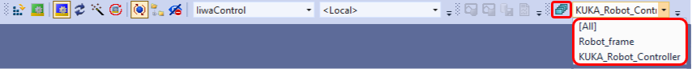
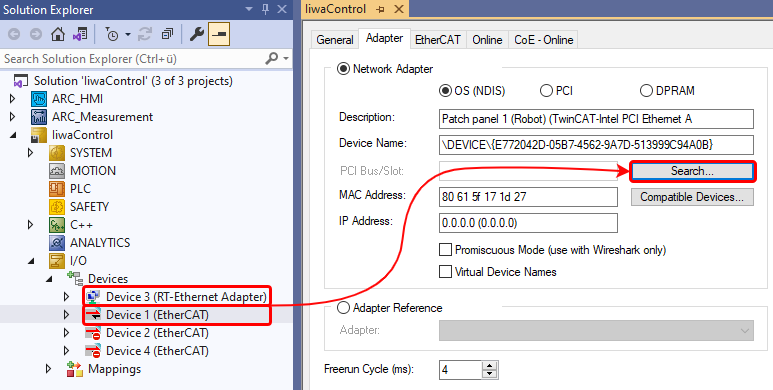
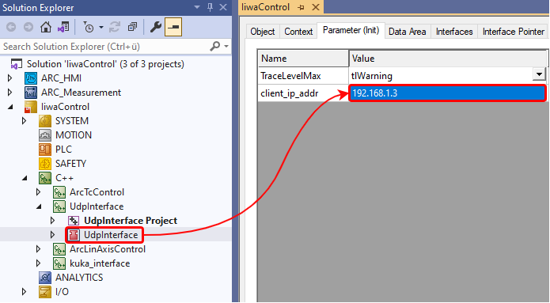
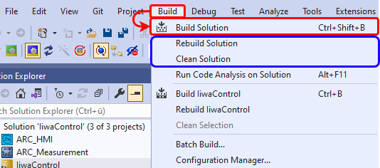
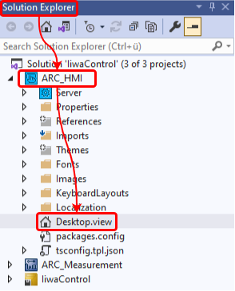
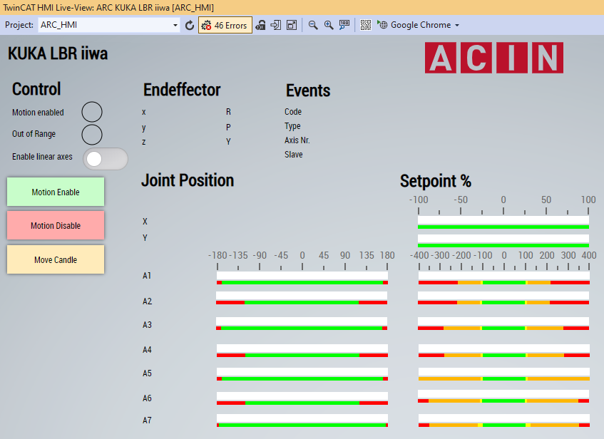
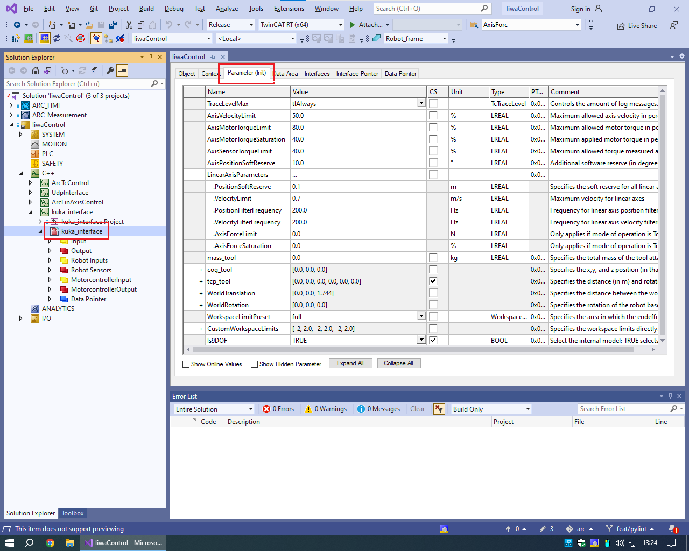

# orc-iiwa-tc

Implementation of ORC for Kuka LBR iiwa for TwinCAT.

# Limitations
`orc-iiwa-tc` requiress a precompiled MuJoCo model in the form of a MJB (binary file). To obtain a real-time loadable MJB file please make sure that:
- The model ought to have exactly 7 joints, i.e., `model.nq` must be 7.
- Make sure to build your MJB file using MuJoCo 3.3.2. Use the [mj_saveModel function](https://mujoco.readthedocs.io/en/3.3.2/APIreference/APIfunctions.html#mj-savemodel).
- No meshes are part of your model. This is easily achievable by setting the [discardvisual flag](https://mujoco.readthedocs.io/en/3.3.2/XMLreference.html#compiler-discardvisual) inside your XML model to true.
- More exotic features like deformable objects, height fields, etc. are not supported. 

# Setup
For using ORC on Kuka LBRiiwa open the `IiwaControl` project file.

It is necessary to change the project variant according to the robot setup. 

- **TESLA**: `KUKA_Robot_Controller`
- **BERNOULLI / PASCAL**: `Robot_Frame`

<div style="text-align: center;">
    
</div>

Connecting the robot to the TwinCat Environment is done at the `I/O -> Device` section:

- Variant: **KUKA_Robot_Controller**
    - Device 2: `Robot`
    - Device 3: `Ethernet 7 (ROS)`
    - Device 4: `MFT`
- Variant: **Robot_Frame**
    - Device 1: `Patch panel 1 (Robot)`
    - Device 3: `Patch panel 2 (ROS)`

<div style="text-align: center;">
    
</div>

The UDP connection need to be set to the specific ip adress for communication with orcpy:

- **BERNOULLI**: 192.168.1.3
- **PASCAL**: 192.168.2.3
- **TESLA**: 192.168.1.3

<div style="text-align: center;">
    
</div>

# Build
Building orc library and TwinCAT environment can be done at `Build -> Build Solution`. If the build completed, but something is still not working, a `Rebuild / Clean` might solve the problem.

<div style="text-align: center;">
    
</div>

To start the whole TwinCat Configuration press `Command Activate configuration` Button. This will build the environment (if not already done) and downloads the realtime configuration. Afterward the realtime environment is started.

<div style="text-align: center;">
    
</div>

# Enable the robot
To activate the robot the Human Machine Interaface (HMI) must be activate. Activate it at `Solution Explorer -> ORC_HMI -> Desktop.view -> (right click) -> Show in Live-View...`.

<div style="text-align: center;">
    
</div>

HMI give the option to enable the linear axes if used in the `Robot_Frame` configuration. To control the robot it need to be enabled via `Motion Enable` button. After driving the robot disable it with `Motion Disable` button! The robots end effector lights ``green`` if the robot is able to move, otherwise it lights ``blue``! Move to candle moves the robot into the zero joint position.
<div style="text-align: center;">
    
</div>

# Parameter configuration

There are some parameters you can adapt. To do this, double click on the C++ module you want to configure and navigate to the Parameter (Init) tab. Short explanations can be found in the *Comment* section of the parameters. 

**Only change parameters, when absolutely certain it is necessary!!**

For the 9DOF robot most parameters can be found in the ```kuka_module``` module. 

<div style="text-align: center;">
    
</div>

**```LinearAxisParameters.PositionSoftReserve```**: Specifies the position soft reserve added as *padding* to the workspace limits for both x and y axes. Changing the later described workspace limits is therefore to be done with caution, and in combination with changing this parameter.

**```WorkspaceLimitPreset```** and **```CustomWorkspaceLimits```**: With ```WorkspaceLimitPreset``` a preset workspace can be chosen from the options *full*, *leftOnly*, *rightOnly*, and *custom*. If the TCP leaves the workspace, a soft stop is initiated. In case *custom* has been selected, ```CustomWorkspaceLimits``` apply. The other presets translate to:

| Preset    | X axis range (m) | Y axis range (m) | Z axis range (m) |
|-----------|------------------|------------------|------------------|
| full      | [0.39, 2.6]      | [0.24, 1.685]    | [0, 1.58]        |
| leftOnly  | [1.64, 2.6]      | [0.24, 1.685]    | [0, 1.58]        |
| rightOnly | [0.39, 1.28]     | [0.24 1.685]     | [0, 1.58]        |

These limits are taken from an internal linear-axes guide.

**```AxisForceLimits```** and **```AxisForceSaturation```**: These two parameters only apply, if the mode of operation is set to torque.
