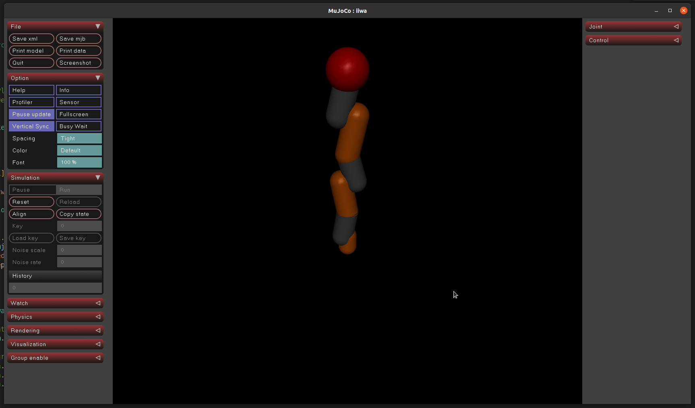

Getting Started
==================

To test out if everything is working fine, you can run the following example code.

.. code-block:: bash

    # Execute from the root of the repository
    python examples/python/simulate_iiwa.py

This script will create a simple simulation of a KUKA LBR iiwa robot in MuJoCo. If everything is set up correctly, you should see a MuJoCo window pop up displaying the robot. The simulation also opened a trajectory server, awaiting incoming trajectories to execute.

You can send a test trajectory executing the following script in a new terminal:

.. code-block:: bash

    python examples/python/sending_iiwa_ex.py

You should see the robot moving in the simulation window, as well as additional information being printed to the terminal.

Changing the simulation flag in the sending example to False will work out of the box (assuming the default network configuration aligns with the user's).

Detailed explanation of the example
***************************************

The simulation script ``simulate_iiwa.py`` performs the following steps:

- Preporatory steps: Loading of MuJoCo model, as well as instantiation of a ``orc::robots::Iiwa`` class with given controller parameters and calling the ``iiwa.start()`` function for the initial setup.
- Setting up a ``TrajectoryServer`` to receive trajectories from and send robot data to the trajectory sending script ``sending_iiwa_ex.py`` over UDP.
- Running a simulation loop, where in each iteration:
   - The current joint positions and velocities are obtained from the MuJoCo simulation, and passed to the ``orc::robots::Iiwa`` instance using the ``set_q_act_filtered_derivatives``.
   - The ``update`` function of the robot is called to compute control commands based on the current measurements and active trajectories.
   - The computed joint torques are then obtained from the ``orc::robots::Iiwa`` instance using the ``get_tau_act`` function, and applied to the MuJoCo simulation.
   - Finally, the robot state is sent back over the trajectory server for logging or further processing.

The trajectory sending script ``sending_iiwa_ex.py`` performs the following steps:

- Construction of a ``orcpy::robots::Iiwa`` instance for simple communication via the ``TrajectoryServer``.
- If run without any additional command line arguments the script will
    1. Send a jointspace trajectory with end state ``numpy.ones(7)``.
    2. Send a taskspace trajectory moving the end-effector upwards by 0.15m.
    3. Send a taskspace trajectory moving the end-effector downwards by 0.15m.
    4. Send a joint space trajectory back to the candle position ``numpy.zeros(7)``.
- If run using command line argument ``j`` the script will only send a jointspace trajectory.
- If run using command line argument ``t`` the script will only send a taskspace trajectory.
